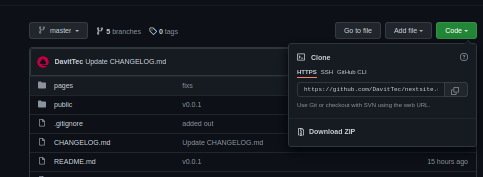

## NextSite - Getting Started


Hosting a Next.js website with GitHub Pages example


First, run the development server:

1. Choose a place to run a local copy and open the terminal
1. Get copy from Github  eg



and copy the following into the terminal. This will create a appropriate location or change to suit your preferences.
```bash
mkdir -p "$HOME/GitHub/DavitTec/"
git clone https://github.com/DavitTec/nextsite.git $HOME/GitHub/DavitTec/nextsite
cd $HOME/GitHub/DavitTec/nextsite
pwd

```


```bash

echo "Check installed versions"
echo -e "VERSIONS\nNode:\t$(node -v)\nNVM:\t$(nvm -v)\nNPM:\t$(npm -v)\n"

```

```bash
npm update # update any missing packages
npm run dev # run the development

```
Open [http://localhost:3000](http://localhost:3000) with your browser to see the result.

You can start editing the page by modifying `pages/index.js`.
The page auto-updates as you edit the file.


## References
https://dev.to/jameswallis/deploying-a-next-js-app-to-github-pages-24pn
